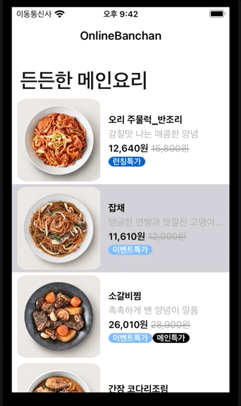
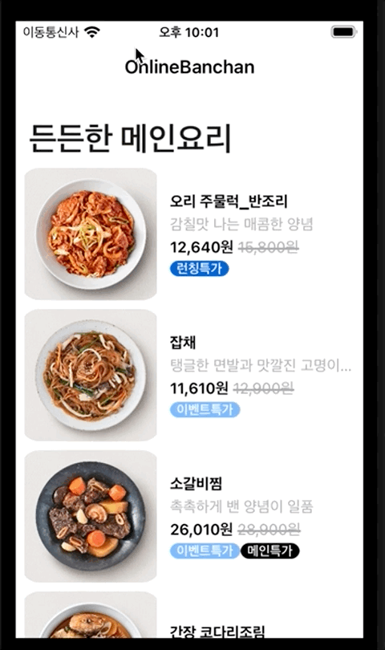
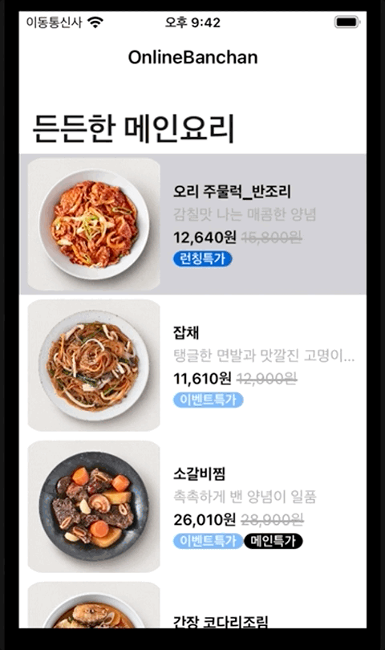
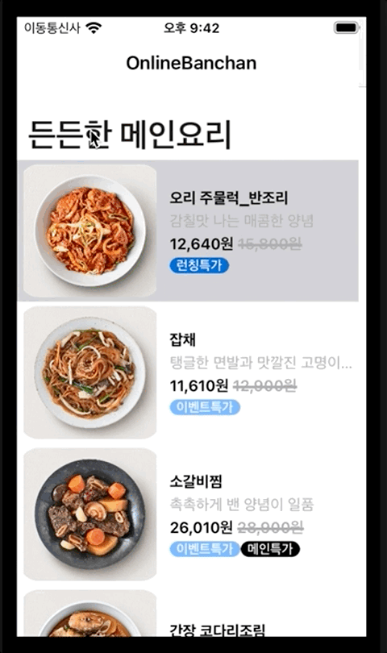
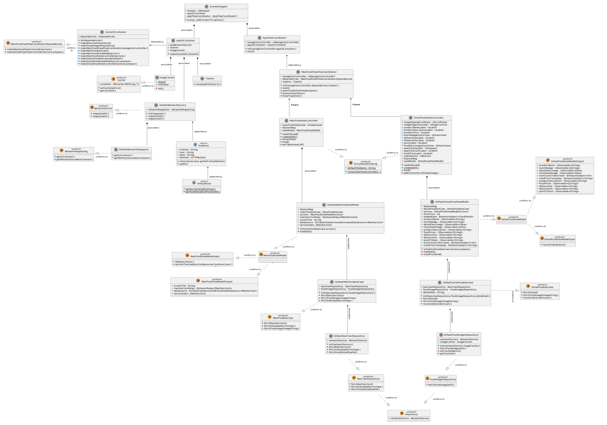
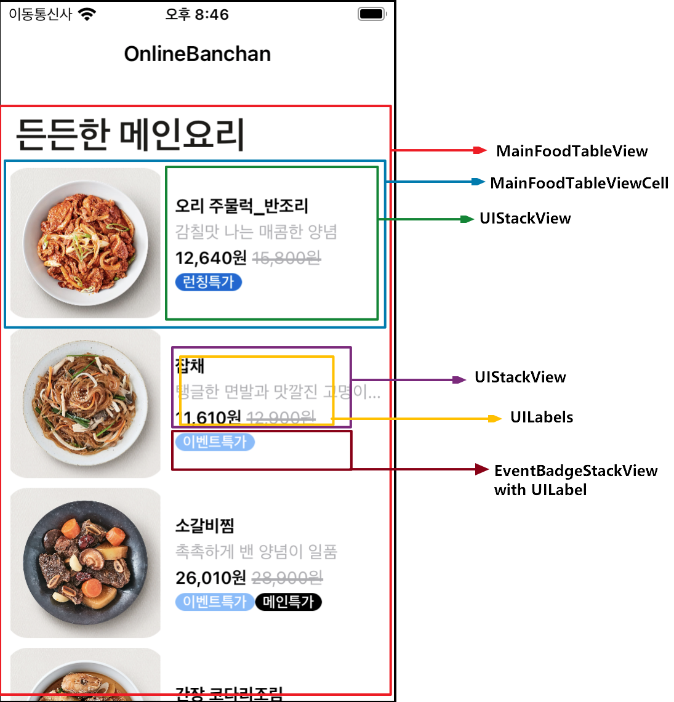
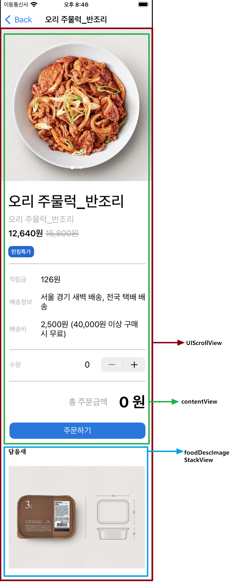
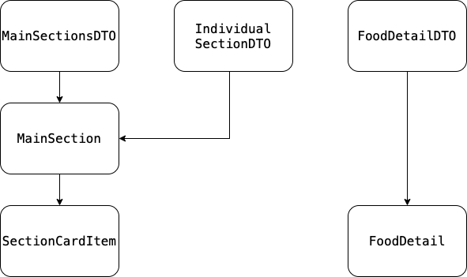

# 빌드 방법
1. 프로젝트의 폴더에서 pod install
2. Target에서, Signing & Capabilities에서 Team 수정
3. 빌드

## 개발 환경
  - xcode : Version 13.4.1 (13F100)
  - 외부 라이브러리
  - `RxSwift` `RxCocoa` `RxDataSources` `Alamofire` `RxBlocking`

---

# 목차
  1. [프로젝트 소개](#프로젝트-소개)
     1. [목표와 의의](#목표와-의의)
     2. [사용한 기술](#사용한-기술)
     3. [사용 시나리오](#사용-시나리오)
     4. [주요 기능 작동 영상](#주요-기능-작동-영상)
  2. [프로젝트 설명](#프로젝트 설명)
     1. [Project UML](#Project-UML)
     2. [UI 구성](#UI-구성)
     3. [Pattern 구성](#Pattern-구성)
        - [DIContainer pattern](#DIContainer-Pattern)
        - [Coordinator Pattern](#Coordinator-Pattern)
        - [Delegate Pattern](#Delegate-Pattern)
     4. [객체 역할 소개](#객체-역할-소개)
        - [Model 구조 설명](#Model-구조-설명)
        - [View 관련](#View-관련)
        - [Logic 관련](#Logic-관련)
     5. [Model 구조 설명](#Model-구조-설명)
  3. [고민했던 내용](#고민한-부분)
  4. [회고](#회고)
  5. [일기같은 개발일지](#일기같은-개발일지)
  
# 프로젝트 소개
## 목표와 의의
- 개인적 challenge: RxSwift, Alamofire의 숙련도를 높인다.
- 어플리케이션 설계 목표: CodeSquad의 sideDishApp Project의 디자인과 요구 기능에 부합하는 App 구현

## 사용한 기술
-  `Coordinator Pattern`, `Delegate Pattern`, `Dependency Injection`, 
-  `MVVM-C`, `Storyboard`, `Auto-Layout` 

## 사용 시나리오
1. 앱 시동.
2. 상품의 목록이 TableView로 출력.
3. 특정 상품을 터치하여 상세 화면으로 이동.
4. 수량을 결정하고 주문버튼을 눌러 주문.

## 주요 기능 작동 영상

| 상품 목록 표기| 상품의 Section을 터치 시, Section의 상품 갯수 출력 | 상세 상품 화면 | 상품의 갯수를 조절하여 주문 |
|---|---|---|---|
|
 
|

|

|

|

# 프로젝트 설명
## Project UML

 
  

## UI 구성

| 앱 메인 화면| 상세 화면 scrollView 구성 | 상세 화면 UI 구성 |
|---|---|---|
|
 
|

|

|

## Pattern 구성
### DIContainer Pattern
### Coordinator Pattern
### Delegate Pattern
 - VC -> VM에서 처리하는 VMInput내용. 이거 delegate임

## 객체 역할 소개
### Model 구조 설명

 
  

### View 관련

| class / struct               | 역할                                                         |
| ---------------------------- | ------------------------------------------------------------ |
| `SceneDelegate`              | - 앱의 초기 권한 요청, Coordinator 및 비즈니스 로직 객체를 생성함.  |
| `AppFlowCoordinator`         |    |
| `MainFoodViewFlowCoordinator`|    |
| `MainFoodViewController`     |    |
| `DetailFoodViewController`   |    |
| `MainFoodViewModel`          | - 전달받은 볼륨 파형 Data를 사용하여 User가 볼륨 파형을 쉽게 알 수 있도록 한다. |
| `DetailFoodViewModel`        | - 전달받은 볼륨 파형 Data를 사용하여 User가 볼륨 파형을 쉽게 알 수 있도록 한다. |
### Logic 관련

| class / struct               | 역할                                                         |
| ---------------------------- | ------------------------------------------------------------ |
| `MainFoodUseCase`         | -     |
| `DetailFoodUseCase`         | -     |
| `DefaultBanChanRepository`      | -   |
| `DefaultFoodImageRepository`      | -   |
| `AppDIContainer`           | -    |
| `SceneDIContainer`           | -    |
| `Toaster`             | -  |
| `ImageCacher`             | -  |
| `DefaultNetowrkService`             | -   |
| `DefaultNetowrkRequester`             | -  |
| `EndPoint`             | -  |
| `APIEndPoint`             | -  |

# 고민했던 내용
 - imageCacher가 왜 singleton인지.
 - DIConatiner가 왜 좋은지
 - BehaviorSubject를 왜 썼는지. DetailView > 데이터를 받아서 표기하는 로직 > PublishedSubject와 비교하여 진행
 - 스탭퍼와 total가격의 로직. -> BehaviorSubject
 - 받아온 SectionCardItem을 통해 Detail의 정보를 모두 받아오고, image또한 다 받아올 수 있는데 굳이 그렇게 하지 않은 이유. -> 사용 할 지 안할지 모르는 정보를 미리 받아오는 것은 옳지 않으므로.
 - DetialView의 많은 IBAction을 왜 customView로 뺴내지 않았는지 -> VC에 view의 코드만 두는것이 mvvm. 화면전환에 대한 코드마저 coordinator로 빼내었다. customView를 적용하여 UI요소를 한번 더 정리 할 수 있겠지만, customView를 내부에서 다시한번 바인딩해야한다. 이는 큰 의미가 없다고 봄.
 - MainFoodViewFlowCoordinatorDependencies는 interface를 제한한다고 볼 수 있지않음?
 - 프로토콜을 사용하여 유연한 구조를 사용하려 함.
 - 가짜 주문기능을 어떻게 구현 할 것인지.
 - 페이징가능한 thumbnail에 대한 얘기.
 - 설명 이미지에 대한 얘기.
 
# 회고
 - bugfix못해서 아쉽다.
 - DetailView 설명image autolayout 버그
 - 빠르게 개발해서 어려웠던 점.
 - Activity Indicator를 추가하면 좋겠다는 얘기.
 
# 일기같은 개발일지

[개발일지로 가는 링크😊](https://github.com/dahun-lee-daji/OnlineBanChan/wiki/%EA%B0%9C%EB%B0%9C%EC%9D%BC%EC%A7%80)

