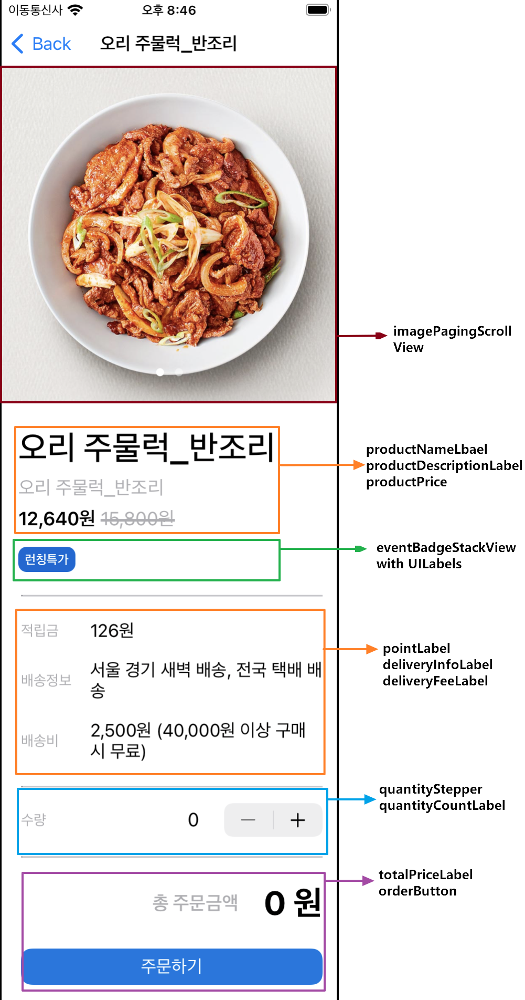

# 빌드 방법
1. 프로젝트의 폴더에서 pod install
2. Target에서, Signing & Capabilities에서 Team 수정
3. 빌드

## 개발 환경
  - xcode : Version 13.4.1 (13F100)
  - 외부 라이브러리
  - `RxSwift` `RxCocoa` `RxDataSources` `Alamofire` `RxBlocking`

---

# 목차
  1. [프로젝트 소개](#프로젝트-소개)
     1. [목표와 의의](#목표와-의의)
     2. [사용한 기술](#사용한-기술)
     3. [사용 시나리오](#사용-시나리오)
     4. [주요 기능 작동 영상](#주요-기능-작동-영상)
  2. [프로젝트 설명](#프로젝트-설명)
     1. [Project UML](#Project-UML)
     2. [UI 구성](#UI-구성)
     3. [객체 역할 소개](#객체-역할-소개)
        - [Model 구조 설명](#Model-구조-설명)
     4. [Model 구조 설명](#Model-구조-설명)
  3. [일기같은 개발일지](#일기같은-개발일지)
  
# 프로젝트 소개
## 목표와 의의
- 개인적 challenge: RxSwift, Alamofire의 숙련도를 높인다.
- 어플리케이션 설계 목표: CodeSquad의 sideDishApp Project의 디자인과 요구 기능에 부합하는 App 구현

## 사용한 기술
-  `Coordinator Pattern`, `Delegate Pattern`, `Dependency Injection`, 
-  `MVVM-C`, `Storyboard`, `Auto-Layout` 

## 사용 시나리오
1. 앱 시동.
2. 상품의 목록이 TableView로 출력.
3. 특정 상품을 터치하여 상세 화면으로 이동.
4. 수량을 결정하고 주문버튼을 눌러 주문.

## 주요 기능 작동 영상

| 상품 목록 표기| 상품의 Section을 터치 시, Section의 상품 갯수 출력 | 상세 상품 화면 | 상품의 갯수를 조절하여 주문 |
|---|---|---|---|
|
 
|

|

|

|

# 프로젝트 설명
## Project UML

 
  

## UI 구성

| 앱 메인 화면| 상세 화면 scrollView 구성 | 상세 화면 UI 구성 |
|---|---|---|
|
 
|

|

|

## 객체 역할 소개
### Model 구조 설명

 
  

# 일기같은 개발일지

[개발일지로 가는 링크😊](https://github.com/dahun-lee-daji/OnlineBanChan/wiki/%EA%B0%9C%EB%B0%9C%EC%9D%BC%EC%A7%80)

